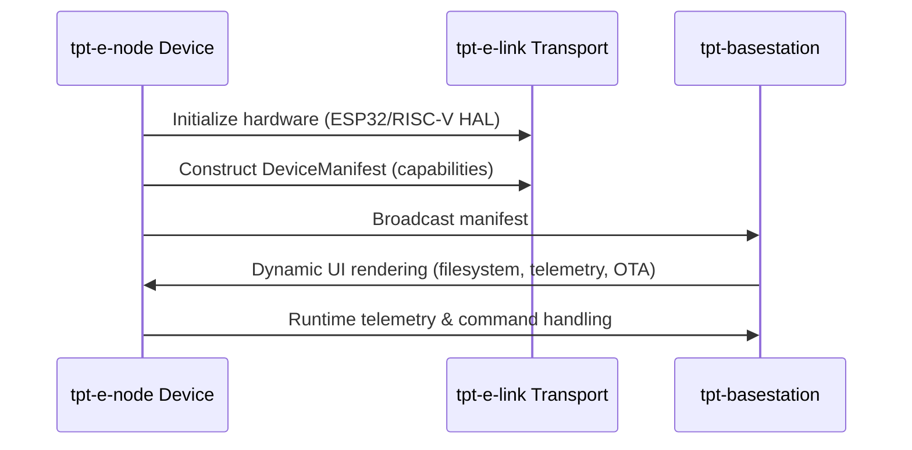

# TPT Embedded Node (tpt-e-node)

**Device Firmware SDK for the TPT Ecosystem**

[](https://github.com/tpt-solutions/tpt-e-node)
[](LICENSE)
[](https://www.rust-lang.org)

---

## Overview

**tpt-e-node** is the device-side runtime and Hardware Abstraction Layer (HAL) SDK for the [TPT (Telemetry Protocol Transport)](https://github.com/tpt) ecosystem. While [`tpt-e-link`](https://github.com/tpt/tpt-e-link) defines the protocol language, **tpt-e-node provides the muscle and brain for the physical hardware**.

It is structured as a **Rust workspace** that allows:
- **Hobbyists** to flash a pre-built template in **5 minutes**
- **Engineers** to build custom, production-grade firmware in a **memory-safe, `no_std` environment** for **ESP32** and **RISC-V** architectures

---

## Key Features

| Feature | Description |
|---------|-------------|
| 🚀 **5-Minute Setup** | Clone a template, flash it, and see your device instantly recognized in [tpt-basestation](https://github.com/tpt/tpt-basestation) |
| 🔄 **Architecture Agnostic** | Identical core runtime logic runs on ESP32 (Xtensa/RISC-V) and generic RISC-V chips |
| 🛡️ **Memory Safe** | Leverages Rust's `no_std` ecosystem to eliminate buffer overflows and memory leaks |
| 🧩 **Composable Capabilities** | Register hardware features (filesystem, sensors, OTA) for automatic BaseStation discovery |
| 🧪 **Mock-First Development** | Test device logic entirely on your laptop via `tpt-node-mock` before deploying to hardware |

---

## Architecture

```
tpt-e-node/
├── Cargo.toml                 # Workspace root
├── crates/
│   ├── tpt-node-core/         # Architecture-agnostic runtime & state machines
│   ├── tpt-node-esp32/        # ESP32 HAL (UART, BLE, Flash) using `esp-hal`
│   └── tpt-node-riscv/        # Generic RISC-V HAL using `riscv-rt` + `embedded-hal`
└── templates/
    ├── esp32-blinky/          # Quickstart template for ESP32 hobbyists
    └── riscv-sensor/          # Quickstart template for RISC-V hobbyists
```

### Core Crates

| Crate | Purpose |
|-------|---------|
| **`tpt-node-core`** | The "brains" — async reactor/event loop, capability registry, internal handlers (OTA, LittleFS) |
| **`tpt-node-esp32`** | The "muscle" for ESP32 — implements `LinkTransport` for UART/BLE, handles partitions & flash |
| **`tpt-node-riscv`** | The "muscle" for generic RISC-V — implements `LinkTransport` via `embedded-hal` traits |

---

## How It Works



### Capability Registration (User Code)

```rust
// Example: Registering capabilities in your firmware
node.register_capability(Capability::LittleFS(my_fs_driver));
node.register_capability(Capability::Telemetry(my_sensor_reader));
node.register_capability(Capability::OTA); // Automatic chunked download + CRC + flash
```

---

## Quickstart (5 Minutes)

See the full guide in [`docs/quickstart.md`](docs/quickstart.md). In short:

```bash
# 1. Install toolchain
cargo install cargo-generate probe-rs-tools
cargo install espflash            # ESP32 only

# 2. Generate project from template (ESP32 or RISC-V)
cargo generate --git https://github.com/tpt-solutions/tpt-e-node --path templates/esp32-blinky

# 3. Flash to device
cd my-device
cargo build --release --features esp32c3 --target riscv32imc-unknown-none-elf
espflash flash -p <PORT> --monitor target/riscv32imc-unknown-none-elf/release/my-device
```

> **Result:** Your device handshake reaches `tpt-basestation` and the matching
> capability cards unlock instantly — no manual pairing.

---

## Mock-First Development

Develop and test **entirely on your laptop** — no hardware required:

```bash
# Run simulated device with fake filesystem & sensors
cargo run --bin tpt-node-mock
```

This starts a WebSocket-based mock transport that connects to tpt-basestation, letting you:
- Test OTA update flows
- Validate telemetry streaming
- Debug command handling
- Iterate on UI/UX before flashing real silicon

---

## Roadmap

See [`todo.md`](todo.md) for the authoritative, phase-by-phase checklist. Summary:

| Phase | Focus | Status |
|-------|-------|--------|
| **Phase 0** | `tpt-e-link` dependency (path-based co-development) | ✅ Done |
| **Phase 1** | Cargo workspace, `tpt-node-core` reactor, capability registry, internal OTA handler | ✅ Done |
| **Phase 2** | Two-layer manifest integration (wire ↔ `tpt-basestation` host manifest) — see [`docs/manifest-mapping.md`](docs/manifest-mapping.md) | ✅ Done |
| **Phase 3** | Mock-first dev experience: `tpt-node-mock` over WebSocket, BaseStation-side listener & UI wiring | ✅ Done |
| **Phase 4** | `tpt-node-esp32` HAL (UART/BLE transports, OTA/LittleFS flash bindings) | ✅ Done |
| **Phase 5** | `tpt-node-riscv` generic HAL (`embedded-hal` UART transport) | ✅ Done |
| **Phase 6** | `cargo-generate` templates, "5-Minute Quickstart" docs | ✅ Done |

---

## Ecosystem

| Component | Description |
|-----------|-------------|
| **[tpt-e-link](https://github.com/tpt/tpt-e-link)** | Protocol definition & transport traits |
| **[tpt-basestation](https://github.com/tpt/tpt-basestation)** | Web-based device management & visualization UI |
| **tpt-e-node** | This repo — device firmware SDK |

---

## License

Licensed under either of:
- **MIT License** ([LICENSE-MIT](LICENSE-MIT))
- **Apache License 2.0** ([LICENSE-APACHE](LICENSE-APACHE))

at your option.

---

## Contributing

See [CONTRIBUTING.md](CONTRIBUTING.md) for guidelines. We welcome:
- Hardware support for new MCUs
- Capability implementations (sensors, actuators, storage)
- Documentation improvements
- Bug reports & feature requests

---

**Part of the [TPT](https://github.com/tpt) ecosystem** — Making embedded IoT development delightful.